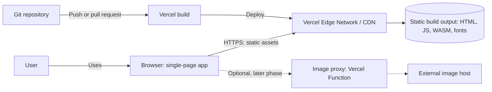
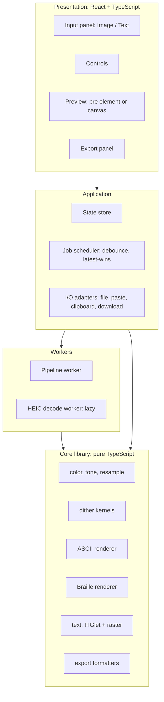
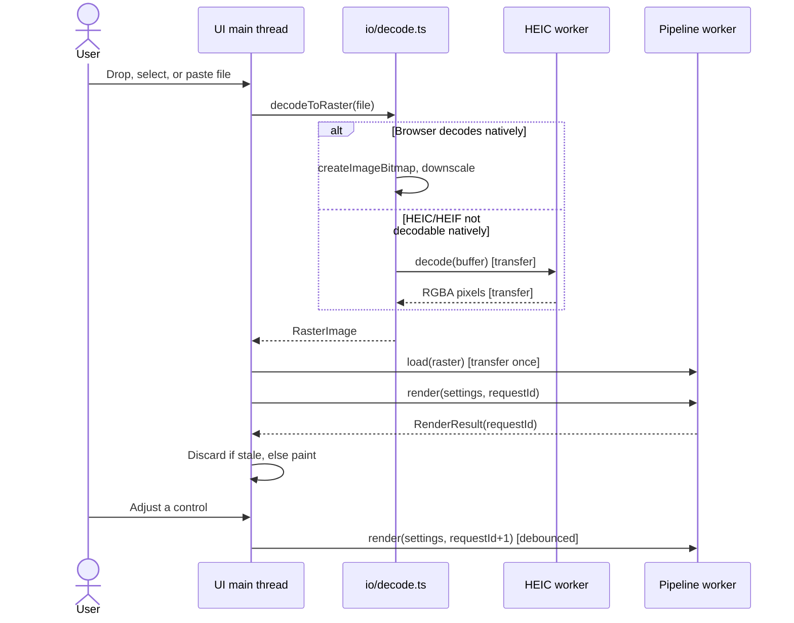

# Architecture

System design for the ASCII & Braille Art Generator. Diagrams and normalized interfaces on this page describe the target architecture unless labeled current. See [milestones.md](milestones.md) for implementation progress.

## Contents

- [Principles](#principles)
- [System context](#system-context)
- [Logical architecture](#logical-architecture)
- [Technology stack](#technology-stack)
- [Repository layout](#repository-layout)
- [Runtime and threading](#runtime-and-threading)
- [Data model](#data-model)
- [Error handling](#error-handling)
- [Extending the app](#extending-the-app)
- [Decision log](#decision-log)

## Principles

1. **Client-only compute.** Decoding, conversion, and export all run in the browser. Vercel serves static files.
2. **Pure core, thin shell (target).** Image algorithms are mostly independent. Current text helpers under `src/core/text/` use DOM APIs and import state types; move those dependencies to adapters as the text path is completed.
3. **Off the main thread (target).** Image processing has a worker; raster text currently runs on the main thread.
4. **Lazy loading (target).** FIGlet font files are fetched on demand. The HEIC fallback and export helpers do not yet exist.
5. **Deterministic output.** The same input and settings always produce the same text. This makes snapshot testing possible.

## System context

The diagram below shows the intended deployment context, including an optional future image proxy. The HEIC fallback and transfer-once optimization are not implemented.



There is no application server in v1. The only optional server piece is the URL-image proxy described in [deployment.md](deployment.md#optional-image-proxy).

## Logical architecture



| Layer | Responsibility | May depend on |
|---|---|---|
| Presentation | Rendering UI, capturing input | Application |
| Application | State, scheduling, browser API adapters | Workers, Core |
| Workers | Off-thread decode and conversion | Core |
| Core | All algorithms | Nothing outside itself |

The diagram expresses the dependency goal. Most image algorithms follow it, but current text helpers under `src/core/text/` import state types and browser APIs. The HEIC worker and export formatters shown here are planned.

## Technology stack

This document describes the current scaffold and planned extension points. Rows marked “planned” are not installed or wired in the repository yet.

| Concern | Choice | Why |
|---|---|---|
| Language | TypeScript, strict mode | Typed pixel buffers and settings |
| Build | Vite | Fast dev loop, built-in worker and WASM support, Vercel preset |
| UI | React | Many interdependent controls |
| Styling | CSS Modules | Scoped, no runtime cost |
| HEIC | Native browser decoding | Fallback `libheif-js` worker is planned |
| FIGlet | Local fonts, picker, and direct render path | Build and browser verification remain |
| Unit tests | Planned Vitest harness | No test dependency is installed yet |
| E2E tests | Planned Playwright harness | No browser test script is installed yet |
| Hosting and CI | Vercel-ready, CI planned | No `vercel.json` or workflow is committed |

## Repository layout

The tree below is a target layout for planned text, HEIC, tests, and export modules. For the actual checkout, see the repository tree in `README.md`; absent paths should not be created unless the related feature is being implemented.

```text
.
├─ public/
│  └─ fonts/
│     ├─ figlet/                 # *.flf fonts, lazy-loaded
│     ├─ figlet-fonts.json       # name, category, file, size
│     └─ ui/                     # self-hosted fonts for raster text
├─ src/
│  ├─ app/                       # Shell, routes, providers
│  ├─ ui/                        # InputPanel, Controls, Preview, ExportPanel
│  ├─ state/                     # Settings store, persistence
│  ├─ workers/
│  │  ├─ pipeline.worker.ts
│  │  └─ heic.worker.ts
│  ├─ io/                        # decode.ts, sniff.ts, clipboard.ts, download.ts
│  ├─ core/
│  │  ├─ color.ts
│  │  ├─ resample.ts
│  │  ├─ tone.ts
│  │  ├─ dither/                 # kernels.ts, errorDiffusion.ts, ordered.ts
│  │  ├─ ascii/                  # ramp.ts, density.ts, edges.ts, render.ts
│  │  ├─ braille/                # bitmap.ts, render.ts
│  │  ├─ text/                   # figlet.ts, rasterText.ts
│  │  └─ export/                 # text.ts, fullwidth.ts, discord.ts, png.ts
│  └─ types.ts
├─ tests/
├─ docs/
└─ vercel.json
```

## Runtime and threading

| Thread | Work |
|---|---|
| **Main** | UI, state, file/URL image loading, and worker lifecycle |
| **Pipeline worker** | Receives pixel data and settings, resamples, applies tone, dithers, and renders ASCII/Braille output |
| **Future workers** | HEIC fallback and text/export work may move off-thread when those features are implemented |

**Current message flow (broken).** The main thread decodes an image and creates a transferable pixel-buffer copy, but `src/app/App.tsx` does not include `imageData` in the posted payload. The worker expects that field, so this path must be repaired before image conversion is considered functional. Transfer-once caching is a later optimization.

**Latest-wins scheduling (target).** The current code has no request ID or debounce. Its processing callback depends on the entire state object, so rerenders can dispatch additional work. Add stable scheduling and discard stale results before claiming responsive rendering.

The sequence diagram below is the **target** flow, not the current worker protocol.



## Data model

The interfaces below describe the intended normalized model. The current state types live in `src/state/types.ts`, and the worker currently accepts a `ProcessPayload` defined in `src/workers/pipeline.worker.ts`.

```ts
export interface RasterImage {
  width: number;
  height: number;
  data: Uint8ClampedArray; // RGBA, 8 bits per channel
}

export type Dithering =
  | { algorithm: 'none' }
  | { algorithm: 'floyd-steinberg' | 'atkinson' | 'custom'; strength: number; serpentine: boolean; kernelId?: string }
  | { algorithm: 'ordered'; matrix: 2 | 4 | 8; strength: number }
  | { algorithm: 'blue-noise'; strength: number };

export interface CommonSettings {
  columns: number;      // 20–300, default 120
  brightness: number;   // -100..100
  contrast: number;     // 0.25..3
  gamma: number;        // 0.5..2.5
  stretchX: number;     // 0.5..2
  stretchY: number;     // 0.5..2
  invert: boolean;
  dithering: Dithering;
  color: 'none' | 'source' | 'gradient';
  background: 'transparent' | 'black' | 'white';
}

export interface AsciiSettings extends CommonSettings {
  mode: 'ascii';
  ramp: string;                    // lightest to darkest
  calibrateRamp: boolean;
  cellAspect: number;              // character width / line height, default 0.5
  edge: { enabled: boolean; threshold: number };
}

export interface BrailleSettings extends CommonSettings {
  mode: 'braille';
  threshold: 'otsu' | number;
  fillBlank: boolean;              // replace U+2800 with U+2804
}

export interface RenderResult {
  text: string;                    // '\n'-separated
  cols: number;
  rows: number;
  colors?: Uint8Array;             // RGB per cell when color is on
}
```

Text-mode settings are in [text-mode.md](text-mode.md#settings).

## Error handling

The following typed errors and user messages are the **target** contract. The current app mainly logs decode and worker failures to the console; it does not yet show these inline messages.

| Error code | Cause | User message |
|---|---|---|
| `unsupported-format` | Native decode failed and the file is not HEIC | "This file type isn't supported." |
| `file-too-large` | Size over limit | "This file is larger than 25 MB." |
| `image-too-large` | Pixel count over limit | "This image has too many pixels." |
| `decode-failed` | Corrupt or truncated file | "This file couldn't be read." |
| `cors-blocked` | URL host disallows cross-origin reads | "That site doesn't allow loading its images here." |
| `clipboard-denied` | Clipboard API blocked | "Couldn't copy. Use Download instead." |

Worker errors are reported to the console and clear the processing state. Typed error mapping and retry behavior are planned.

## Extending the app

**Add a dither kernel.** Add an entry to `src/core/dither/index.ts` (see the `Kernel` shape in [processing.md](processing.md#dithering)), register its id, and add it to the Dithering control. Add a golden test when the test harness exists.

**Add a ramp preset.** Add the string to `src/core/ascii/index.ts`. Presets must be ordered lightest to darkest.

**Complete text rendering.** Correct the existing FIGlet/raster paths, verify both outputs, and document bundled font licenses before distribution.

**Add an export format.** Add a pure formatter under `src/core/`, then wire the action in `src/ui/ExportPanel.tsx`.

## Decision log

| # | Decision | Reason | Consequence |
|---|---|---|---|
| 1 | Process everything client-side | Privacy, no server cost, instant results | Bounded by device memory; URL loading limited by CORS |
| 2 | Dither the whole Braille dot grid before packing | Error must flow across cell boundaries | Slightly more memory than per-cell thresholding |
| 3 | Quantize ASCII to measured glyph densities | Real glyph densities are not evenly spaced | Needs a calibration step per font |
| 4 | Dither in linear light | Dots and ink average in linear light | Requires sRGB conversion up front |
| 5 | HEIC: native first, `libheif-js` fallback | Skips a large download where the browser can decode | Two code paths to test |
| 6 | Use `libheif-js` directly, not a converter | Raw pixels, no lossy re-encode | Slightly more integration code |
| 7 | Rasterize text on the main thread | Fonts are loaded there | Small buffer transfer to the worker |
| 8 | Transfer pixels once; send only settings afterward | Avoids copying megabytes per slider tick | Worker holds state; needs explicit `load` |
| 9 | Latest-wins request IDs | Prevents stale results overwriting newer ones | Small amount of scheduling code |
| 10 | No third-party scripts | Tight CSP, privacy | Analytics, if wanted, must be same-origin |
